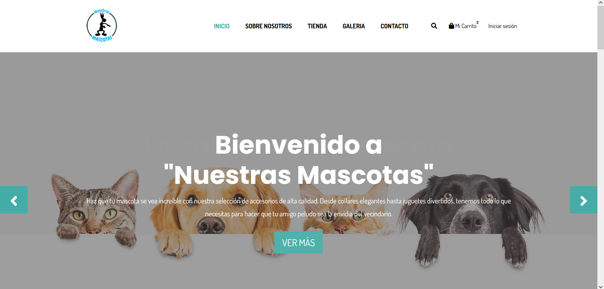

# codigodetienda

Proyecto NuestrasMasctas

Es un proyecto de una tienda de venta de productos para mascotas, es una pagina intuitiva y facil de usar, en donde posee un carrito de compras dinamico, un register validado, un login, donde ademas muestra el equipo de trabajo y el rol de cada uno.
En cuanto a codigo, utilizamos framework´s basados en PhP, validaciones de carrito a traves de cookies, validaciones de login a traves de PhP.

Lenguaje utilizado: HTML
    Se utilizo hojas de estilo para la creacion de las diversas pestañas del proyecto, tales como:

    INDEX

Esta es la pagina principal, donde puedes visualizar y navegar sobre las diversas pestañas del proyecto.
    Carro de compras

Este es el carro de compras, donde uno puede visualizar los productos agregados para su posterior compra con diversos metodos de pagos.
    Register

En esta pestaña podras registrar al usuario para quedar almacenado en la base de datos(Los campos estan validados).
    Login

En esta pestaña podras iniciar sesion con los datos registrados previamente, accediendo a la pagina principal (Los campos estan validados).

Lenguaje utilizado: Css3
    Estas son las hojas de estilos utilizadas en los archivos HTML:

    Estilo de Navbar

Lenguaje utilizado: JavaScript
    Estas son las funciones utilizadas para el carro de compras

    Validaciones carro de compras

Lenguaje utilizado: PhP
    Esta es utilizada para la conexion de base de datos

    Conexion con PhP

